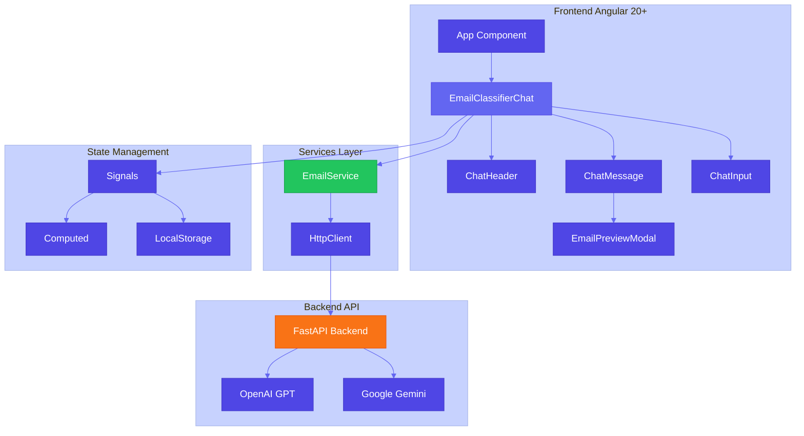
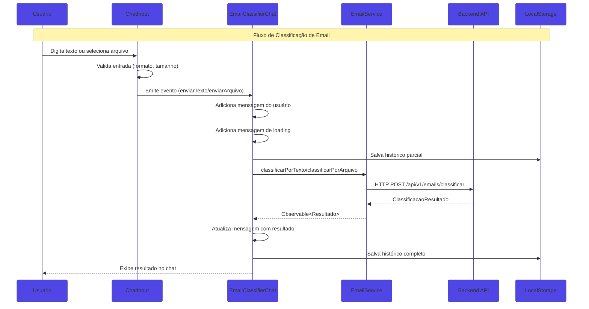
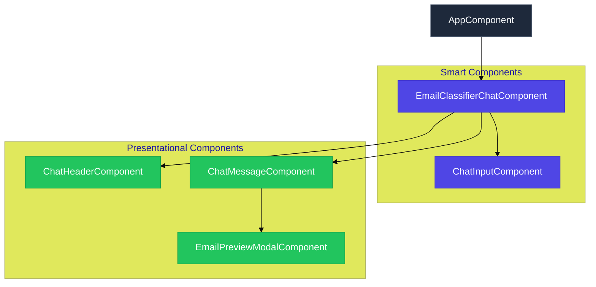
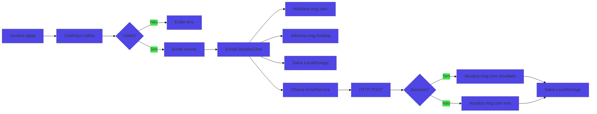
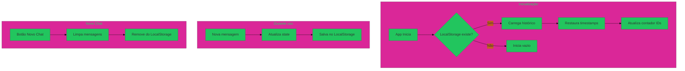

# 📧 AutoU Email Classifier — Frontend Angular

[](https://angular.dev/)
[](https://www.typescriptlang.org/)
[](https://rxjs.dev/)
[](https://sass-lang.com/)
[](https://angular.dev/guide/signals)
[](https://angular.dev/guide/ssr)
[](https://vercel.com/)
[](https://cloud.google.com/run)
[](https://www.docker.com/)
[](https://developer.mozilla.org/en-US/docs/Web/API/Window/localStorage)

> Interface de chat moderna para classificação automática de emails usando IA (OpenAI GPT e Google Gemini)

## 🚀 Visão Geral

O **AutoU Email Classifier** é uma aplicação frontend moderna desenvolvida em **Angular 20+** que oferece uma interface de chat interativa para classificação automática de emails usando Inteligência Artificial. A aplicação se comunica com um backend FastAPI e suporta múltiplos provedores de IA (OpenAI GPT e Google Gemini).

### 🎯 Proposta de Valor

- **Interface de Chat Interativa**: Experiência de chat moderna para classificação de emails
- **Multi-Provider de IA**: Suporte a OpenAI GPT e Google Gemini com seleção dinâmica
- **Persistência Local**: Histórico de conversas salvo via LocalStorage
- **Upload de Arquivos**: Suporte a múltiplos formatos de email (.txt, .pdf, .eml, .msg, .mbox)
- **Preview Profissional**: Modal de visualização de email formatado
- **Sintaxe Angular Moderna**: Standalone Components, Signals, `@if/@for`, `inject()`
- **Server-Side Rendering**: Angular SSR para melhor SEO e performance
- **Deploy Otimizado**: CDN global via Vercel com cache inteligente

## 🏗️ Arquitetura Geral do Sistema



### Fluxo Principal do Sistema

```text
1. Usuário acessa aplicação Angular
2. Componente carrega histórico do LocalStorage (se existir)
3. Usuário seleciona provider de IA (OpenAI ou Gemini)
4. Usuário digita texto ou faz upload de arquivo
5. Frontend envia requisição para Backend via HTTP
6. Backend processa com IA selecionada
7. Resposta retorna e é exibida no chat
8. Histórico é salvo automaticamente no LocalStorage
```

## 🔄 Arquitetura de Componentes

### Sistema de Comunicação Frontend



### Hierarquia de Componentes



## 🏗️ Stack Tecnológica

### Framework & Linguagem

| Tecnologia | Versão | Descrição |
|------------|--------|-----------|
| **Angular** | 20.3+ | Framework frontend enterprise moderno |
| **TypeScript** | 5.4+ | Tipagem estática para desenvolvimento escalável |
| **RxJS** | 7.8+ | Programação reativa para requisições HTTP |
| **SCSS** | - | Pré-processador CSS para estilos avançados |

### Sintaxe Moderna Angular 20+

| Feature | Descrição | Exemplo |
|---------|-----------|---------|
| **`inject()`** | Injeção de dependência moderna | `private readonly service = inject(EmailService)` |
| **`signal()`** | Estado reativo com signals | `readonly carregando = signal(false)` |
| **`computed()`** | Propriedades calculadas reativas | `readonly podeEnviar = computed(() => ...)` |
| **`input()`** | Inputs com signal | `readonly resultado = input.required<T>()` |
| **`output()`** | Outputs tipados | `readonly enviar = output<Data>()` |
| **`viewChild()`** | ViewChild com signal | `readonly container = viewChild<ElementRef>()` |
| **`@if/@for/@switch`** | Nova sintaxe de controle de fluxo | `@if (loading()) { ... }` |
| **Standalone** | Componentes sem NgModules | `standalone: true` |

### Infraestrutura & Deploy

| Componente | Tecnologia | Descrição |
|------------|------------|-----------|
| **Frontend** | Vercel | CDN global com edge functions e proxy reverso |
| **Backend** | Google Cloud Run | Container serverless em São Paulo (southamerica-east1) |
| **Desenvolvimento** | Docker Compose | Ambiente containerizado com hot-reload |
| **SSR** | Angular SSR | Server-Side Rendering para SEO |
| **Persistência** | LocalStorage | Histórico de conversas no browser |
| **Cache** | HTTP Headers | Assets estáticos com cache de 1 ano (immutable) |
| **Proxy** | Vercel Rewrites | Roteamento `/api/*` para Cloud Run |

## 📁 Estrutura do Projeto

```text
frontend/
├── src/
│   ├── app/
│   │   ├── components/           # Componentes Angular
│   │   │   ├── chat-header/      # Header do chat (Presentational)
│   │   │   ├── chat-input/       # Input e upload (Smart)
│   │   │   ├── chat-message/     # Mensagem do chat (Presentational)
│   │   │   ├── email-classifier-chat/  # Container principal (Smart)
│   │   │   ├── email-preview-modal/    # Modal de preview (Presentational)
│   │   │   ├── email-upload/     # Upload alternativo (Smart)
│   │   │   └── resultado-classificacao/ # Resultado (Presentational)
│   │   ├── models/               # Interfaces TypeScript
│   │   │   ├── classificacao.model.ts
│   │   │   └── email.model.ts
│   │   ├── services/             # Serviços HTTP
│   │   │   └── email.service.ts
│   │   ├── app.ts                # Componente raiz
│   │   ├── app.config.ts         # Configuração da aplicação
│   │   └── app.routes.ts         # Rotas (se houver)
│   ├── environments/             # Variáveis de ambiente
│   │   ├── environment.ts        # Desenvolvimento
│   │   └── environment.prod.ts   # Produção
│   ├── styles.scss               # Estilos globais
│   └── index.html                # HTML principal
├── angular.json                  # Configuração Angular CLI
├── package.json                  # Dependências
├── tsconfig.json                 # Configuração TypeScript
└── vercel.json                   # Configuração Vercel
```

## 🎯 Componentes Funcionais

### 1. EmailClassifierChatComponent (Smart Component)

**Responsabilidades:**

- **Gerenciamento de Estado**: Controla mensagens, loading e provider selecionado
- **Persistência**: Salva/carrega histórico do LocalStorage
- **Comunicação**: Orquestra chamadas ao EmailService
- **Scroll Automático**: Gerencia scroll para novas mensagens

**State Management com Signals:**

```typescript
// State
readonly mensagens = signal<ChatMessage[]>([]);
readonly carregando = signal(false);
readonly providerSelecionado = signal<AIProvider>('openai');
readonly providers = signal<ProvidersResponse | null>(null);

// Computed
readonly temMensagens = computed(() => this.mensagens().length > 0);
```

**Persistência LocalStorage:**

```typescript
const CHAT_STORAGE_KEY = 'autou-email-classifier-chat-history';

private carregarHistoricoChat(): void {
    const stored = localStorage.getItem(CHAT_STORAGE_KEY);
    if (stored) {
        const mensagens = JSON.parse(stored);
        this.mensagens.set(mensagens);
    }
}

private salvarHistoricoChat(): void {
    localStorage.setItem(CHAT_STORAGE_KEY, JSON.stringify(this.mensagens()));
}
```

### 2. ChatInputComponent (Smart Component)

**Responsabilidades:**

- **Input de Texto**: Textarea com Enter para enviar
- **Upload de Arquivo**: Validação de formato e tamanho
- **Seleção de Provider**: Dropdown para escolher OpenAI ou Gemini
- **Validação**: Controle de estado para habilitar/desabilitar envio

**Validações Implementadas:**

```typescript
// Formatos suportados
const formatosSuportados = ['txt', 'pdf', 'eml', 'msg', 'mbox'];

// Tamanho máximo: 5MB
if (arquivo.size > 5 * 1024 * 1024) {
    this.erro.set('Arquivo muito grande. Tamanho máximo: 5MB');
}
```

### 3. ChatMessageComponent (Presentational)

**Responsabilidades:**

- **Exibição de Mensagens**: Diferencia mensagens do usuário e da IA
- **Indicador de Loading**: Skeleton animation durante processamento
- **Resultado da Classificação**: Badge de categoria com cor dinâmica
- **Ações**: Copiar resposta e abrir modal de preview

### 4. EmailPreviewModalComponent (Presentational)

**Responsabilidades:**

- **Preview Profissional**: Simula visualização de cliente de email
- **Extração de Metadados**: Assunto, remetente e destinatário
- **Tema Dark/Light**: Toggle entre temas
- **Cópia Rápida**: Botão para copiar resposta formatada

## 🔧 Services

### EmailService

**Responsabilidades:**

- **getProviders()**: Lista provedores de IA disponíveis
- **classificarPorTexto()**: Classifica email via texto
- **classificarPorArquivo()**: Classifica email via upload de arquivo

```typescript
@Injectable({ providedIn: 'root' })
export class EmailService {
    private readonly http = inject(HttpClient);
    private readonly apiUrl = `${environment.apiUrl}/emails`;

    getProviders(): Observable<ProvidersResponse> {
        return this.http.get<ProvidersResponse>(`${this.apiUrl}/providers`);
    }

    classificarPorTexto(request: ClassificarEmailRequest): Observable<ClassificacaoResultado> {
        return this.http.post<ClassificacaoResultado>(
            `${this.apiUrl}/classificar`,
            request
        );
    }

    classificarPorArquivo(arquivo: File, provider?: AIProvider): Observable<ClassificarArquivoResponse> {
        const formData = new FormData();
        formData.append('arquivo', arquivo);
        let params = new HttpParams();
        if (provider) params = params.set('provider', provider);
        return this.http.post<ClassificarArquivoResponse>(
            `${this.apiUrl}/classificar/arquivo`,
            formData,
            { params }
        );
    }
}
```

## 🔄 Fluxo de Dados

### Fluxo de Classificação por Texto



### Fluxo de Persistência LocalStorage



## 🎨 Interface do Usuário

### Design System

- **Cores**: Paleta baseada em Slate/Indigo para tema dark
- **Tipografia**: System fonts para performance
- **Espaçamento**: Sistema de 4px/8px
- **Responsividade**: Mobile-first com breakpoints em 640px

### Componentes Visuais

| Componente | Descrição |
|------------|-----------|
| **Chat Container** | Layout de chat estilo WhatsApp/Telegram |
| **Message Bubbles** | Balões diferenciados para user/AI |
| **Loading Skeleton** | Animação de carregamento |
| **Provider Selector** | Dropdown com ícones |
| **Category Badge** | Cores verde (Produtivo) / vermelho (Improdutivo) |
| **Preview Modal** | Overlay com email formatado |

## ⚡ Otimizações de Performance

### Change Detection

Todos os componentes utilizam `OnPush` para otimizar re-renderizações:

```typescript
@Component({
    changeDetection: ChangeDetectionStrategy.OnPush
})
```

### Cache Headers (Vercel)

```json
{
  "headers": [
    {
      "source": "/assets/(.*)",
      "headers": [{ "key": "Cache-Control", "value": "public, max-age=31536000, immutable" }]
    },
    {
      "source": "/(.*)\\.js",
      "headers": [{ "key": "Cache-Control", "value": "public, max-age=31536000, immutable" }]
    }
  ]
}
```

### Security Headers

```json
{
  "headers": [
    { "key": "X-Content-Type-Options", "value": "nosniff" },
    { "key": "X-Frame-Options", "value": "DENY" },
    { "key": "X-XSS-Protection", "value": "1; mode=block" }
  ]
}
```

## 🚀 Como Executar

### Desenvolvimento Local

```bash
# Instalar dependências
npm install

# Executar servidor de desenvolvimento
ng serve

# Ou com alias
npm start
```

Acesse: <http://localhost:4200>

### Build de Produção

```bash
# Build otimizado
npm run build

# Arquivos gerados em: dist/email-classifier/browser/
```

### Deploy Vercel

```bash
# Deploy para preview
vercel

# Deploy para produção
vercel --prod
```

## 🧪 Testes

```bash
# Executar testes unitários
npm test

# Testes em modo watch
npm test -- --watch

# Cobertura de código
npm test -- --code-coverage
```

## 📊 Models TypeScript

### ClassificacaoResultado

```typescript
export interface ClassificacaoResultado {
    categoria: CategoriaEmail;      // 'Produtivo' | 'Improdutivo'
    confianca: number;              // 0.0 a 1.0
    resposta_sugerida: string;      // Resposta gerada pela IA
    assunto?: string | null;        // Assunto extraído
    remetente?: string | null;      // Remetente extraído
    destinatario?: string | null;   // Destinatário extraído
    modelo_usado?: string | null;   // Modelo de IA utilizado
}
```

### ChatMessage

```typescript
export interface ChatMessage {
    id: string;
    tipo: 'user' | 'ai';
    conteudo?: string;
    arquivo?: { nome: string; tamanho: number };
    resultado?: ClassificacaoResultado;
    provider?: AIProvider;
    timestamp: Date;
    carregando?: boolean;
    emailOriginal?: string;
}
```

## 🔮 Destaques Técnicos

### 1. Signals para State Management

Gerenciamento de estado reativo com Signals do Angular:

```typescript
// State reativo
readonly mensagens = signal<ChatMessage[]>([]);
readonly carregando = signal(false);
readonly providerSelecionado = signal<AIProvider>('openai');

// Propriedades derivadas com computed
readonly temMensagens = computed(() => this.mensagens().length > 0);
readonly podeEnviar = computed(() => 
    !this.carregando() && this.conteudoEmail().trim().length > 0
);
```

### 2. Sintaxe Moderna de Template

Controle de fluxo com `@if`, `@for` e `@switch`:

```html
@if (carregando()) {
    <div class="loading-skeleton">...</div>
}

@for (msg of mensagens(); track msg.id) {
    <app-chat-message [message]="msg" />
}

@switch (resultado().categoria) {
    @case ('Produtivo') { <span class="badge-success">✓</span> }
    @case ('Improdutivo') { <span class="badge-warning">○</span> }
}
```

### 3. Standalone Components

Componentes auto-suficientes sem necessidade de NgModules:

```typescript
@Component({
    selector: 'app-chat-message',
    standalone: true,
    imports: [PercentPipe, EmailPreviewModalComponent],
    templateUrl: './chat-message.component.html',
    changeDetection: ChangeDetectionStrategy.OnPush
})
export class ChatMessageComponent {
    readonly message = input.required<ChatMessage>();
    readonly copiarResposta = output<string>();
}
```

### 4. Injeção de Dependência Moderna

Uso de `inject()` ao invés de constructor injection:

```typescript
export class EmailClassifierChatComponent {
    private readonly emailService = inject(EmailService);
    private readonly platformId = inject(PLATFORM_ID);
    private readonly isBrowser = isPlatformBrowser(this.platformId);
}
```

### 5. Persistência com LocalStorage

Sistema de persistência SSR-safe:

```typescript
const CHAT_STORAGE_KEY = 'autou-email-classifier-chat-history';

private carregarHistoricoChat(): void {
    if (!this.isBrowser) return; // SSR-safe

    const stored = localStorage.getItem(CHAT_STORAGE_KEY);
    if (stored) {
        const mensagens = JSON.parse(stored).map((msg: any) => ({
            ...msg,
            timestamp: new Date(msg.timestamp)
        }));
        this.mensagens.set(mensagens);
    }
}

private salvarHistoricoChat(): void {
    if (!this.isBrowser) return;
    localStorage.setItem(CHAT_STORAGE_KEY, JSON.stringify(this.mensagens()));
}
```

### 6. Input/Output com Signal API

Nova API de inputs e outputs tipados:

```typescript
// Inputs
readonly resultado = input.required<ClassificacaoResultado>();
readonly providers = input<ProvidersResponse | null>(null);
readonly carregando = input(false);

// Outputs
readonly enviarTexto = output<{ conteudo: string; provider: AIProvider }>();
readonly enviarArquivo = output<{ arquivo: File; provider: AIProvider }>();
readonly novoChat = output<void>();
```

### 7. ViewChild com Signal

Acesso a elementos do DOM com signals:

```typescript
readonly messagesContainer = viewChild<ElementRef>('messagesContainer');

private scrollToBottom(): void {
    const container = this.messagesContainer();
    if (container) {
        container.nativeElement.scrollTop = container.nativeElement.scrollHeight;
    }
}
```

## 🛠️ Skills Técnicas Demonstradas

### Frontend Development (Modern Angular)

- **Angular 20.3+** - Framework enterprise moderno
- **TypeScript 5.4+** - Tipagem estática avançada
- **Signals** - Estado reativo sem RxJS para UI
- **Standalone Components** - Arquitetura modular
- **OnPush Change Detection** - Performance otimizada
- **SSR** - Server-Side Rendering

### State Management

- **Signals** - Estado local reativo
- **Computed** - Propriedades derivadas
- **LocalStorage** - Persistência de histórico

### UI/UX

- **Responsive Design** - Mobile-first
- **Dark Theme** - Interface moderna
- **Animations** - Loading skeletons
- **Accessibility** - Keyboard navigation

### DevOps

- **Vercel** - Deploy com CDN global
- **Cache Headers** - Performance otimizada
- **Security Headers** - Proteção contra ataques

---

## Desenvolvido com ❤️ usando Angular 20+ e Clean Architecture

Aplicação frontend moderna demonstrando as melhores práticas de desenvolvimento Angular com Signals, Standalone Components e sintaxe moderna de templates.
